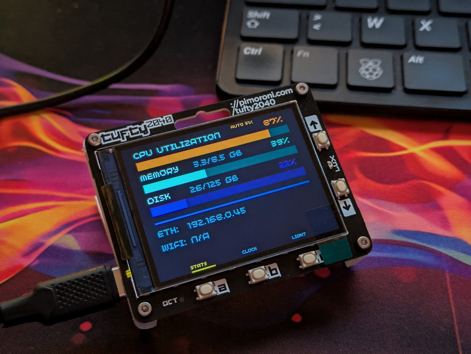

# 📊 Tufty 2040 LCARS System Monitor



A **Star Trek LCARS** style system monitoring tool for Raspberry Pi using a **Pimoroni Tufty 2040** (RP2040) display.

## 🎮 Features
- **Standby / Waiting Screen:** Displays an LCARS standby status until initial data is received over USB.
- **Real-time Metrics:** Monitors CPU, RAM, Disk Usage, and active network IPs (ETH/WIFI).
- **Dynamic Gauge Colors:** Color transitions automatically based on workload (Normal → Amber at 80% → Red at 90%).
- **Auto Brightness:** Ambient light adjustment using the built-in phototransistor (with a safe floor at 50%).
- **Clock Mode:** Switchable via Button B (RTC Clock + Stardate display).
- **Background Service:** Includes Systemd integration to launch automatically at host boot.

---

## 🛠️ Project Architecture

- `host/`: Python script running on the host computer to collect and stream metrics over Serial (USB), along with Systemd setup scripts.
- `tufty/`: MicroPython script running directly on the Pimoroni Tufty 2040.

---

## ⚡ Quick Start

### 1. Preparing the Tufty 2040
1. Flash the latest **Pimoroni PicoGraphics** MicroPython firmware for Tufty 2040.
2. Transfer `tufty/main.py` to the root of the MicroPython filesystem using **Thonny IDE**.

### 2. Preparing the Raspberry Pi & Installing Service
```bash
cd host
chmod +x setup_env.sh
./setup_env.sh

### 3. Command Line Arguments (`sender.py`)

| Argument | Type | Default | Description |
| :--- | :--- | :--- | :--- |
| `port` | Positional | *Required* | Serial port identifier (e.g. `COM7`, `/dev/ttyACM0`). |
| `--baud` | Int | `115200` | Serial baud rate. |
| `-o`, `--offset` | Int | `0` | Timezone offset in hours relative to system time. |
| `-d`, `--debug` | Flag | `False` | Enables printing serial responses and logs received from the Tufty 2040. |

---

## Manual Execution

Run the host sender script by passing the serial port and your timezone offset:

```bash
# Example for Windows on COM7 with UTC+2 timezone offset:
python host/sender.py COM7 -o 2

# Example for Linux/macOS on /dev/ttyACM0 with UTC+1 and debug mode enabled:
python host/sender.py /dev/ttyACM0 -o 1 --debug

---

## Serial Protocol Specification

Frames are sent as UTF-8 single-line strings delimited by pipes (`|`) and terminated with `\n`.

- **Initial / Recurring Time Sync Payload:**
  ```text
  INIT_TIME:1788278534
  ```
- **Standard Telemetry Payload:**
  ```text
  CPU:12.5|RAM_PCT:48.2|RAM_U:7.7|RAM_T:16.0|DISK_PCT:62.1|DISK_U:310.5|DISK_T:500.0|ETH:192.168.1.50|WIFI:N/A
  ```
- **Merged Periodic Telemetry & Sync Payload:**
  ```text
  CPU:12.5|RAM_PCT:48.2|...|ETH:192.168.1.50|WIFI:N/A|INIT_TIME:1788278534
  ```

---

## Tufty 2040 UI Navigation

- **Button A (STATS):** Display real-time CPU, RAM, Disk, and Network interface status.
- **Button B (CLOCK):** Display full-screen LCARS digital clock, Date, and StarDate derived directly from RP2040 hardware RTC.
- **Button C (LIGHT):** Toggle automatic lux sensor backlight control.
- **Up / Down Buttons:** Manually adjust screen brightness level.
